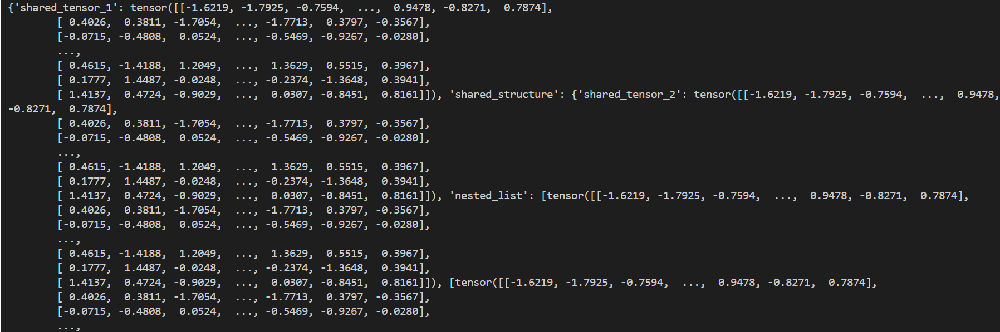
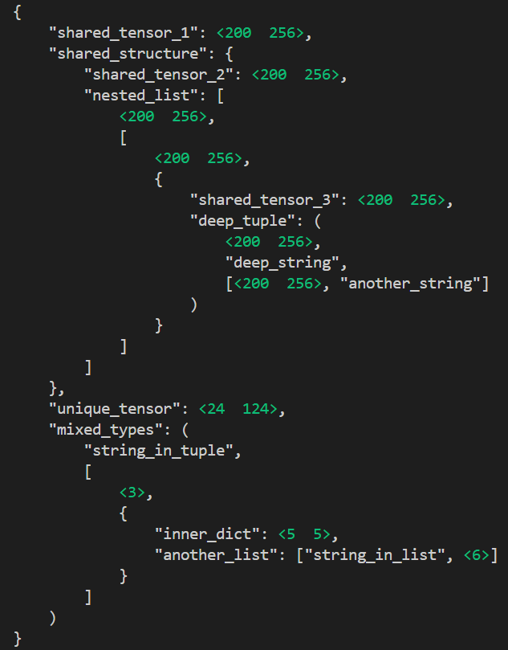
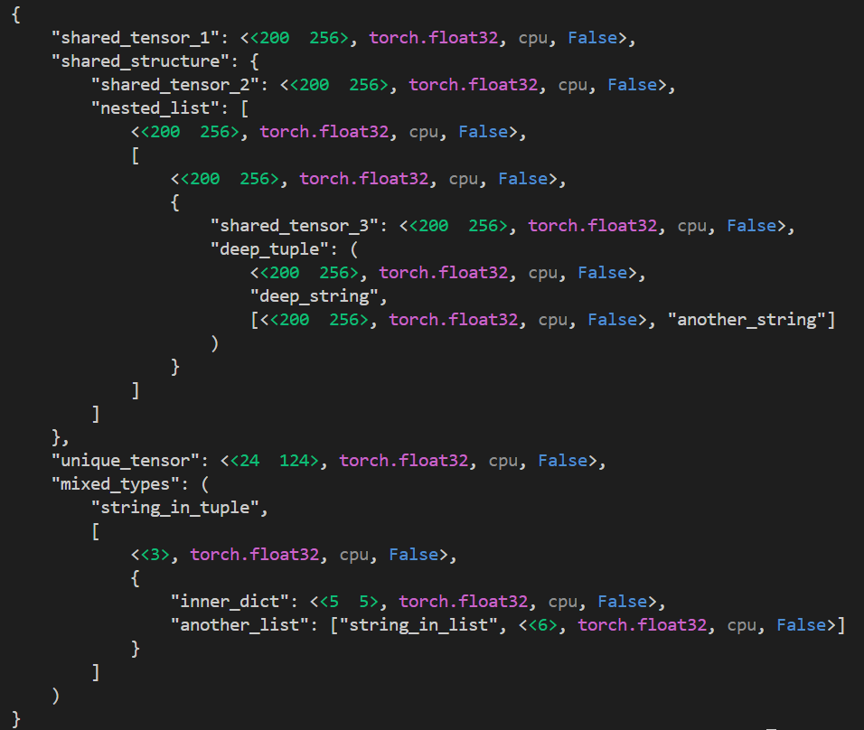

# ObjectSkeleton

A small code that helps you see the skeleton of Python objects when debugging/inspecting Deep Learning codes (**only supports simple objects like torch.Tensor, list, tuple, dict**)

## :question: Introduction

In Deep Learning projects, understanding the structure of complex Python objects can be a daunting task. When working with large models or intricate functions, determining the architecture of an object often requires printing each component individually. This process is not only tedious but also time-consuming, especially when you need to repeat it multiple times during development and debugging.

For example, printing a variable to inspect its content often results in a cluttered mess like this:


**90% of the time, we only care about the shapes of the tensors, not their actual data!** So to fully understand such an object, we either have to dive into the source code or play the tedious "print-and-debug" game—both of which can be frustrating and time-consuming before we can get anything meaningful done.

## :rocket: The Solution: ObjectSkeleton

_ObjectSkeleton_ is a small Python utility designed to simplify the process of inspecting and understanding the structure of Python objects, particularly in Deep Learning projects. With just a single command, you can visualize the hierarchy and composition of any Python object, eliminating the need for repetitive and cumbersome print statements.

**Key Benefits:**

:white_check_mark: Provides a structured and readable outline of an object's attributes, making it easier to grasp complex structures.

:white_check_mark: Saves time by reducing the need to write multiple print statements or manually navigate through object attributes.

:white_check_mark: Only need one import and one print statement

## :hammer_and_wrench: Installation

Only Pytorch is needed, because we mainly deal with Tensors:

```
pip install torch
```

## :computer: How to use

Suppose the above variable's name is **x**, then with just a single print() command:

```
print(ObjectSkeleton(x))
```


You can see the entire object's structure! These informations are orderly formatted and colored for the sake of debug.

For more detailed informations such as data types, device or requires_grad, please use:

```
print(ObjectSkeleton(x, detailed_info=True))
```



If you want to try adding new stuffs such as user-defined objects, Tensor data values or track the object's memory usage, you can modify the ObjectSkeleton class as you wish.
